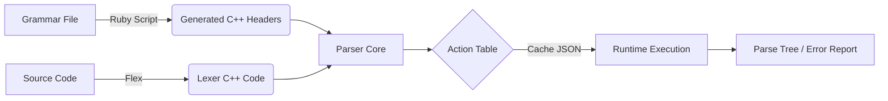

# SLR-parser

- [SLR-parser](#slr-parser)
  - [Сборка и запуск](#сборка-и-запуск)
    - [Требования](#требования)
    - [Пошаговая инструкция](#пошаговая-инструкция)
      - [1. Установка зависимостей (для Ubuntu/WSL)](#1-установка-зависимостей-для-ubuntuwsl)
      - [2. Конфигурация и сборка](#2-конфигурация-и-сборка)
      - [3. Запуск парсера](#3-запуск-парсера)
      - [4. Запуск тестов](#4-запуск-тестов)
  - [📁 Структура репозитория](#-структура-репозитория)
  - [📖 Описание проекта](#-описание-проекта)
    - [Ключевые возможности](#ключевые-возможности)
  - [Архитектура и принцип работы](#архитектура-и-принцип-работы)
    - [1. Подготовка грамматики (Code Generation)](#1-подготовка-грамматики-code-generation)
    - [2. Лексический анализ (Lexer)](#2-лексический-анализ-lexer)
    - [3. Синтаксический анализ (SLR Parser)](#3-синтаксический-анализ-slr-parser)
    - [Схема потока данных](#схема-потока-данных)
  - [Action Table](#action-table)
  - [дневник / мини записи](#дневник--мини-записи)
  - [TODO:](#todo)
- [недоделанная часть с теорией](#недоделанная-часть-с-теорией)
  - [LR(k) грамматика](#lrk-грамматика)
  - [SLR-parser](#slr-parser-1)
    - [DFA](#dfa)
      - [Items](#items)
      - [Closure](#closure)
      - [GOTO](#goto)
    - [Операции конечного автомата (Actions)](#операции-конечного-автомата-actions)
    - [Reduce](#reduce)
    - [SLR-table](#slr-table)
    - [Внутренности SLR парсера](#внутренности-slr-парсера)
    - [Инициализация](#инициализация)
    - [Конечное состояние(успех):](#конечное-состояниеуспех)


## Сборка и запуск

Проект использует систему сборки **CMake** (минимальная версия 3.14). Для работы требуется компилятор C++17, Flex и доступ к интернету (для первой загрузки библиотеки тестов Google Test).

### Требования
* **ОС:** Linux, macOS или Windows (через WSL).
* **Компилятор:** GCC/G++ 9+ или Clang 10+ (с поддержкой C++17).
* **Инструменты:** cmake, make, flex.
* **Зависимости:**
  * libfl (библиотека Flex).
  * Google Test (загружается автоматически при конфигурации).

### Пошаговая инструкция

#### 1. Установка зависимостей (для Ubuntu/WSL)
Выполните в терминале:
```bash
sudo apt-get update
sudo apt-get install build-essential cmake flex libfl-dev
```

#### 2. Конфигурация и сборка
Создайте директорию сборки, сконфигурируйте проект и соберите его:
```bash
mkdir build
cd build
cmake ..
make
```

#### 3. Запуск парсера
Исполняемый файл находится в папке build/src/SLR/. Парсер работает в интерактивном режиме (ввод завершается сочетанием клавиш Ctrl+D на Linux/Mac или Ctrl+Z на Windows).
```bash
./src/SLR/slr_parser
```

#### 4. Запуск тестов
Проект включает набор End-to-End тестов, проверяющих лексический анализ, синтаксический разбор, приоритет операций и обработку ошибок.

Для запуска всех тестов используйте утилиту ctest из папки build:
```bash
ctest --output-on-failure

##Запуск конкретного теста:
ctest -R ParenthesesAndPrecedence --output-on-failure

##Пример вывода успешных тестов:
Test project /path/to/SLR-parser/build
    Start 1: ParserE2ETest.SimpleAddition
1/6 Test #1: ParserE2ETest.SimpleAddition ...............   Passed    0.01 sec
    Start 2: ParserE2ETest.MultiplicationPrecedence
2/6 Test #2: ParserE2ETest.MultiplicationPrecedence ....   Passed    0.01 sec
...
100% tests passed, 0 tests failed out of 6
```

## 📁 Структура репозитория

Проект организован модульно, разделяя этапы лексического анализа, построения грамматик и самого парсинга.

```text
SLR-parser/
├── CMakeLists.txt          # Корневой файл сборки проекта
├── README.md               # Документация проекта
│
├── scripts/                # 🛠 Скрипты генерации кода
│   └── generate_grammar.rb # Ruby-скрипт: парсит грамматику и генерирует C++ заголовки
│
├── data/                   # 📊 Данные и конфигурация
│   ├── grammar.txt         # Исходное описание правил грамматики (BNF)
│   └── slr_cache.json      # Кэш таблиц ACTION/GOTO (генерируется автоматически)
│
├── src/                    # 📂 Исходный код C++
│   ├── lexer/              # Лексический анализатор
│   │   ├── lexer.l         # Спецификация токенов для Flex
│   │   ├── lexer_global.cpp# Глобальные переменные лексера (yylval)
│   │   ├── token_struct.hpp# Структура Token (тип, значение, позиция)
│   │   └── token_type.hpp  # Enum TokenType (устаревший алиас на Symbol)
│   │
│   ├── grammar/            # Модуль работы с грамматикой
│   │   ├── first_follow.cpp# Алгоритмы вычисления множеств First и Follow
│   │   ├── items.cpp       # Работа с позициями (LR(0)-items)
│   │   ├── symbol_utils.cpp# Утилиты для конвертации символов
│   │   └── generated/      # ⚠️ АВТОГЕНЕРИРУЕМЫЕ ФАЙЛЫ (не редактировать!)
│   │       ├── grammar_rules.cpp # Вектор правил продукции
│   │       └── symbol_enums.hpp  # Enum всех терминалов и нетерминалов
│   │
│   └── SLR/                # Ядро синтаксического анализатора
│       ├── main.cpp        # Точка входа: связка Lexer + Parser
│       ├── slr_parser.cpp  # Реализация алгоритма разбора (Shift/Reduce)
│       ├── slr_parser_dump.cpp # Функции вывода состояния (трассировка)
│       ├── table_builder.cpp   # Построитель таблиц ACTION и GOTO
│       └── slr_parser.hpp      # Заголовок класса парсера
│
├── tests/                  # 🧪 Набор тестов
│   ├── CMakeLists.txt      # Конфигурация сборки тестов
│   └── parser_e2e_test.cpp # End-to-End тесты (Google Test)
│
└── build/                  # 🏗 Артефакты сборки (игнорируется в git)
    ├── src/SLR/slr_parser  # Исполняемый файл парсера
    └── tests/parser_tests  # Исполняемый файл тестов
```

## 📖 Описание проекта
Данный проект представляет собой реализацию **синтаксического анализатора (парсера)**, работающего по алгоритму **SLR(1)** (Simple LR). Парсер предназначен для разбора арифметических выражений, проверки их синтаксической корректности и построения последовательности действий (сдвиг/свертка) на основе заданной контекстно-свободной грамматики.

Проект написан на **C++17** и демонстрирует полный цикл работы компилятора: от лексического анализа до синтаксической верификации с поддержкой обработки ошибок и модульного тестирования.

### Ключевые возможности

(это набросок от нейронки)

## Архитектура и принцип работы

Проект модульный и разделен на три основных компонента: Лексер, Генератор таблиц и Парсер.

### 1. Подготовка грамматики (Code Generation)

**Вот эта часть кода на Ruby не up2date!**

Перед сборкой C++ кода выполняется этап подготовки данных грамматики.
*   **Инструмент:** Скрипт на языке **Ruby** (`scripts/generate_grammar.rb`).
*   **Процесс:** Скрипт читает файл с описанием правил грамматики и генерирует C++ заголовочные файлы в директорию [`src/grammar/generated/`](src/grammar/generated/).
*   **Результат:**
    *   `symbol_enums.hpp`: Enum-ы для всех терминалов и нетерминалов.
    *   `grammar_rules.cpp`: Вектор структур `Rule`, описывающих продукцию грамматики.
    *   Эти файлы используются парсером для построения множеств позиций (items) и таблиц разбора.

> ⚠️ **Важно:** При изменении грамматики необходимо заново запустить Ruby-скрипт перед пересборкой проекта.

### 2. Лексический анализ (Lexer)
Модуль отвечает за разбиение исходной строки на токены.
*   **Реализация:** Файл [`lexer.l`](src/lexer/lexer.l) описывает регулярные выражения для токенов.
*   **Генерация:** Утилита **Flex** преобразует `.l` файл в C++ код (`lexer.cpp`).
*   **Структура токена:** Используется единая структура `Token`, хранящая тип (`Symbol`), текстовое значение, числовое значение (для литералов) и позицию в исходном коде (строка/колонка).

### 3. Синтаксический анализ (SLR Parser)
Ядро системы, расположенное в [`src/SLR/`](src/SLR/).
*   **Построение таблиц:** Класс `TableBuilder` динамически вычисляет множества First/Follow, строит каноническую систему множеств позиций (DFA) и заполняет таблицы ACTION и GOTO.
    *   Таблицы кэшируются в JSON-файл (`data/slr_cache.json`) для ускорения запуска.
*   **Алгоритм разбора:**
    1.  Инициализация стека состояний и стека символов.
    2.  Цикл чтения токенов из лексера.
    3.  Поиск действия в таблице по текущему состоянию и токену.
    4.  Выполнение действия:
        *   **Shift:** Сдвиг токена и нового состояния в стек.
        *   **Reduce:** Свертка группы символов в нетерминал согласно правилу грамматики.
        *   **Accept:** Успешное завершение.
        *   **Error:** Выброс исключения с метаданными о позиции ошибки.

### Схема потока данных


## Action Table

Полученная таблица действий для парсера (см. [построение парсера](./src/grammar/data/)).

Ниже представлена таблица переходов для синтаксического анализатора.
*   **S** = Shift (Сдвиг)
*   **R** = Reduce (Свертка)
*   **A** = Accept (Допуск)
*   **-** = Ошибка (Error)

| State | PLUS | MINUS | STAR | SLASH | LPAREN | RPAREN | NUMBER | VAR | END_MARKER |
|:-----:|:----:|:-----:|:----:|:-----:|:------:|:------:|:------:|:---:|:----------:|
| **0** | - | - | - | - | S4 | - | S5 | S6 | - |
| **1** | S7 | S8 | - | - | - | - | - | - | **A** |
| **2** | R6 | R6 | R6 | R6 | - | R6 | - | - | R6 |
| **3** | R3 | R3 | S9 | S10 | - | R3 | - | - | R3 |
| **4** | - | - | - | - | S4 | - | S5 | S6 | - |
| **5** | R7 | R7 | R7 | R7 | - | R7 | - | - | R7 |
| **6** | R8 | R8 | R8 | R8 | - | R8 | - | - | R8 |
| **7** | - | - | - | - | S4 | - | S5 | S6 | - |
| **8** | - | - | - | - | S4 | - | S5 | S6 | - |
| **9** | - | - | - | - | S4 | - | S5 | S6 | - |
| **10** | - | - | - | - | S4 | - | S5 | S6 | - |
| **11** | S7 | S8 | - | - | - | S16 | - | - | - |
| **12** | R1 | R1 | S9 | S10 | - | R1 | - | - | R1 |
| **13** | R2 | R2 | S9 | S10 | - | R2 | - | - | R2 |
| **14** | R4 | R4 | R4 | R4 | - | R4 | - | - | R4 |
| **15** | R5 | R5 | R5 | R5 | - | R5 | - | - | R5 |
| **16** | R9 | R9 | R9 | R9 | - | R9 | - | - | R9 |


##  дневник / мини записи

с помощью скрипта grammar_gen.rb из описания грамматики в grammar.txt генерируются в /grammar/generated:
- enum Symbol в symbol_enums.hpp
- вектор грамматических правил в grammar_rules.cpp

токены: по описанию в grammar/tokens_def.rb генерируются enum-ы токенов в C++.

Приходится в ручную поддерживать когерентность описаний Symbol, Token, и описанием лексики в lexer.l.


## TODO:

- генерацию грамматики проверить, и где вообще когерентность нужно поддерживать
- тесты добавить на парсер, на построение таблиц тест можно в целом тоже
- описание проекта бы более подробно сделать, с мини описанием мотивации решений архитектурных, языковых и т.д.
- рефакторинг примерно всего?
- описание бы адекватное сделать
- план 200%: сделать Panic mode и error recovery


# недоделанная часть с теорией

## LR(k) грамматика

LR(k) (Left-toRight scanning, Rightmost derivation in reverse, k-lookahead) - класс контекстно-свободных грамматик, для которых возможно построение детерминированного восходящего синтаксического анализатора.

Восходящий синтаксический анализатор принимает решения на основе состояния следующих элементов:

1. Input (уже прочитанный вход, не более чем на k символов вперед)
2. Stack (содержание стэка)

В данном проекте используется подмножество LR(1) - SLR(1) для учебных целей ввиду простоты реализации по сравнению с LR(1).

## SLR-parser

В данном методе разбора входная строка из терминалов постепенно "сворачивается" (операция "reduce") по подстрокам к нетерминалам, пока не получится начальный символ грамматики.


### DFA

Для распознавания правых порождений в обратном порядке можно использовать конечный автомат, где
- Состояния DFA: множества пунктов (items) с замыканием
- Переходы: GOTO(I, X), где X - символ грамматики

Конечный автомат здесь моделирует все промежуточные точки в процессе распознавания правил грамматики.


#### Items

Пункт(Item) - правило грамматики с точкой ( . ), показывающей, до какого места уже распознано грамматическое правило.

Т.е. эта конструкция введена как эквивалент текущего положения при парсинге.

Пример:

Для правила:
```cpp
E -> E + T
```
Возможные пункты:
```cpp
E -> . E + T    // ничего не распознано
E -> E . + T    // распознано E
E -> E + . T    // распознано E +
E -> E + T .    // все распознано и готово к свертке
```

С помощью пунктов можно описывать состояния парсера, отсюда возникает модель конечного автомата (DFA - Deterministic Finite Automaton).

Множество всех состояний - это замыкание(closure) множества всех пунктов

#### Closure

Замыкание(closure) - операция над множеством пунктов, которая для пунктов вида

```cpp
A -> a . B b
```

Добавляет все пункты вида

```cpp
B -> . y
```

Прмиер:

Исходный пункт:

```cpp
E -> . T
```

При наличии правил

```cpp
T -> T * P
T -> P
```

 closure добавит:

```cpp
T -> . T * P
T -> . P
P -> . ...
```

Через замыкание добавляются все возможные сценарии последующих символов.

#### GOTO

GOTO - функция перехода LR(0) автомата по нетерминалам.

GOTO(I, X) - это состояние автомата, в которое мы переходим из состояния I по символу X, где X - нетерминал.

Пример:
```cpp
I = {               // текущее состояние
    E -> T .,
    T -> T . * P
}

GOTO(I, *) = { T -> T * . P } // состояние после перехода по '*'

```

т.е. это как бы сдвиг на выбранный символ.


### Операции конечного автомата (Actions)
| Action | Описание |
|--------|------|
| Shift  | перемещение следующего символа строки на вершину стэка |
| Reduce | если вершина стэка совпадает с сентенциальной формой, заменяем порожденную форму на начальную. Т.е. если на вершине стэка **a**, совпадающее с правой частью правила **A -> a**, заменяем **a** на **A** на вершине стэка |
| Accept | строку удалось сматчить до начального символа грамматики |
| Error  | ошибка, нет подходящего грамматического правила |


----------------- здесь про модель конечного автомата добавить


---- добавить

### Reduce


### SLR-table

SLR-таблица строится на основе свех состояний LR(0)-автомата, где каждое состояние - это замыкание(closure) множества пунктов


Таблица ACTION[state, terminal] определяет, что делать, когда на вершине стека состояние state, а следующий входной символ — terminal.
Возможные действия: shift, reduce, accept, error.

Таблица GOTO[state, nonterminal] определяет, в какое состояние перейти после того, как выполнен reduce.
Это просто переход в новое состояние DFA (LR(0)-автомата) по символу-нетерминалу.

### Внутренности SLR парсера

SLR парсер использует два стэка: стэк состояний и стэк символов

### Инициализация

State stack: содержит одно состояние - начальное

### Конечное состояние(успех):

1) на входе - EOF('$')
2) на вершине стэка состояний - состояние start
3) в таблице ACTION[start]['$'] = accept

